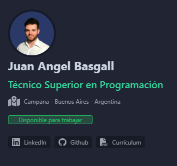

# Portfolio personal con Astro



## Iniciar el proyecto

Primero instalamos las dependencias

```bash
npm i
```

En el proyecto se usan variables de ambiente, por lo que será necesario crear un archivo .env a nivel raíz del proyecto.

Este archivo debería contener las credenciales de firebase, el cual se usa para guardar los mensajes del formulario de contacto y para contar las visitas a la web.

También debería contener una variable "PUBLIC_AVOID" que tu ip y otra variable "PUBLIC_IPINFO_API_KEY" con el valor de tu api key en [ipify](https://www.ipify.org/) . Esta información se usa en el proyecto para que se pueda identificar si el autor tiene al mismo ip que el "PUBLIC_AVOID", en ese caso no se registra la visita en Firebase y se evita alterar los contadores con información falsa o irrelevante.

Con todo esto la estructura del archivo .env debería quedar así:

```bash

# Firebase
PUBLIC_API_KEY:
PUBLIC_AUTH_DOMAIN:
PUBLIC_PROJECT_ID:
PUBLIC_STORAGE_BUCKET:
PUBLIC_MESSAGING_SENDER_ID:
PUBLIC_APP_ID:
PUBLIC_MEASSUREMENT_ID:

# Estas 2 pueden no ser necesarias
PUBLIC_PROFILE_ID:
PUBLIC_MAIL_API_KEY:

# IP y API KEY
PUBLIC_AVOID:
PUBLIC_IPINFO_API_KEY:

```

Una vez creado esto (o en su defecto comentar los lugares donde utilizan las funciones de los modelos) podemos iniciar el proyecto:

```bash
npm run dev
```
